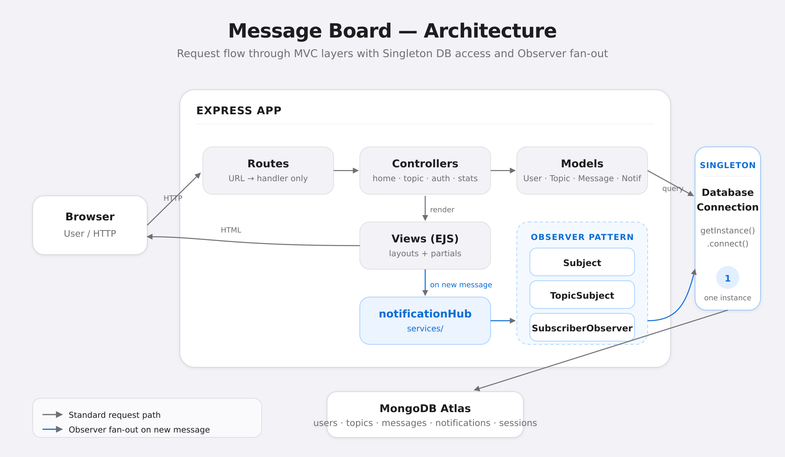
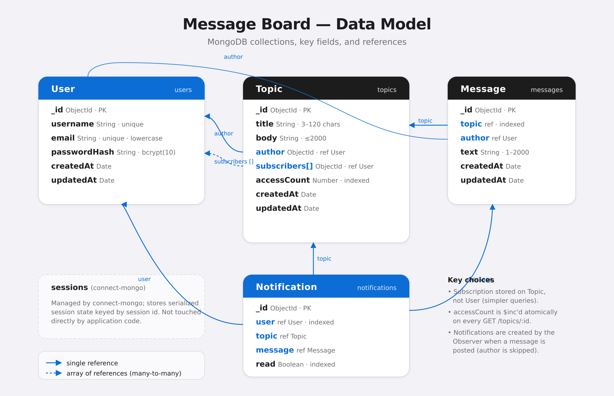

# Message-Board

A Twitter-style message board built for **CMPS 4150 — Enterprise Systems (Spring 2026), Project P1**.
Users register, subscribe to topics (message threads), post messages in subscribed topics, and see the
two most recent messages per subscribed topic on their dashboard.

- **Live app:** https://mongotestpub-r41n.onrender.com/
- **Repo:** https://github.com/taylfrad/Message-Board
- **Team:** Christopher Ford, Taylor Fradella


## Features

| Task | Points | What it is | Where it lives |
| ---- | -----: | ---------- | -------------- |
| T1   | 10 | Topics as message threads | [models/Topic.js](models/Topic.js), `/topics` route |
| T2.1 | 20 | Dashboard shows 2 most recent messages per subscribed topic | [controllers/homeController.js](controllers/homeController.js) `index()` |
| T2.2 | 10 | Browse-topics link + per-topic unsubscribe button | [views/dashboard.ejs](views/dashboard.ejs) |
| T3   | 15 | Create a topic; creator is auto-subscribed | [controllers/topicController.js](controllers/topicController.js) `create()` |
| T4   | 10 | Post a message in a subscribed topic (403 if not subscribed) | [controllers/topicController.js](controllers/topicController.js) `postMessage()` |
| T5   | 10 | MVC architecture | `/models`, `/views`, `/controllers`, `/routes` |
| T6   | 10 | Observer pattern for new-message notifications | [patterns/](patterns/) + [services/notificationHub.js](services/notificationHub.js) |
| T7   |  5 | Singleton for database access | [config/db.js](config/db.js) |
| T8   | 10 | `/stats` route reports per-topic access counts | [controllers/statsController.js](controllers/statsController.js) |

## Screenshots

| Browse topics | Read & post in a thread |
| ------------- | ----------------------- |
|  |  |


## Design patterns



**MVC (T5)** — Mongoose schemas in `/models`, EJS templates in `/views`, request handlers in
`/controllers`, URL wiring only in `/routes`.

**Observer (T6)** — Abstract `Subject` and `Observer` in `/patterns`, plus concrete `TopicSubject`
and `SubscriberObserver`. When a message is posted, [services/notificationHub.js](services/notificationHub.js)
loads the topic's current subscribers, attaches one observer per subscriber to a fresh
`TopicSubject`, and fires a `NEW_MESSAGE` event. Each observer's `update()` writes a `Notification`
document (the message author is skipped).

**Singleton (T7)** — [config/db.js](config/db.js) exposes a `DatabaseConnection` class with a
private static `#instance` field. The constructor throws if called directly; callers must use
`DatabaseConnection.getInstance()`. Server bootstrap ([server.js](server.js)) is the only caller of
`.connect()`; no module anywhere else calls `mongoose.connect()` directly.

## Tech stack

Node.js 18+, Express 5, MongoDB Atlas via Mongoose, EJS with `express-ejs-layouts`,
Tailwind CSS (compiled at deploy time) plus a hand-written Apple-HIG design layer in
[public/css/app.css](public/css/app.css), sessions via `express-session` + `connect-mongo`,
password hashing with bcrypt. Deployed on Render with auto-deploy from the GitHub `main` branch.

## Project layout

```
models/           Mongoose schemas: User, Topic, Message, Notification
views/            EJS templates (layout, dashboard, stats, topics/, auth/, notifications/, partials/)
controllers/      Request handlers (home, topic, auth, stats, notification)
routes/           URL -> controller wiring only
patterns/         Subject, Observer, TopicSubject, SubscriberObserver  (T6)
services/         notificationHub.js  (bridges postMessage to the observer fan-out)
middleware/       requireAuth.js
config/           db.js  (DatabaseConnection singleton, T7)
public/           Compiled Tailwind CSS and static assets
scripts/          seed.js  (wipes + repopulates demo data)
app.js            Express app assembly (middleware, view engine, route mounting)
server.js         Boot: connect DB, start listener
```

## Running locally

```bash
npm install
cp .env.example .env          # fill in MONGODB_URI + SESSION_SECRET
npm run seed                  # optional: wipes DB and inserts demo data
npm run dev                   # nodemon on http://localhost:3000
```

Required environment variables:

| Var | Purpose |
| --- | ------- |
| `MONGODB_URI` | Full MongoDB Atlas connection string including database name |
| `SESSION_SECRET` | Random string used to sign session cookies |
| `PORT` | Optional; defaults to 3000. Render sets this automatically |

## Data model



- **User** — `username` (unique), `email` (unique, lowercased), `passwordHash` (bcrypt, 10 rounds).
  Virtual `password` setter validates length on save.
- **Topic** — `title`, `body`, `author` (User), `subscribers` (User[]), `accessCount` (indexed).
- **Message** — `topic` (Topic, indexed), `author` (User), `text` (1–2000 chars).
- **Notification** — `user` (User, indexed), `topic` (Topic), `message` (Message), `text`,
  `read` (indexed).

Subscription is modeled on the Topic side, so a user's subscribed topics are looked up via
`Topic.find({ subscribers: userId })`.

## Deployment

- **Hosting:** Render free-tier web service; auto-deploys on every push to `main`.
- **Database:** MongoDB Atlas M0 free cluster; IP allowlist set to `0.0.0.0/0` (Render free-tier
  egress IPs are not static — this is the configuration Render documents for Atlas).
- **Sessions:** persisted in a `sessions` collection in the same database via `connect-mongo`.
- **Cold starts:** Render free-tier instances sleep after ~15 minutes of inactivity; the first
  request after idle may take 20–30 seconds.

## License

MIT.
